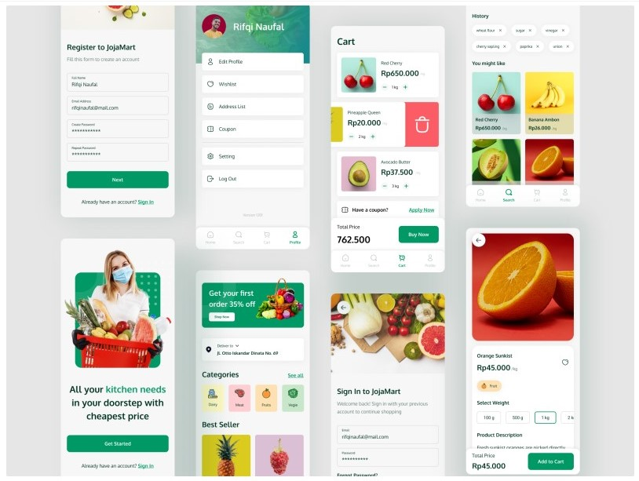

# Grocery App UI


## Quickstart
```bash
$ npm install
```
```bash
$ npm start
```
```bash
$ npx react-native run-android
```

## Screens

1. Welcome
2. Sign In
3. Register
4. Home
5. Single Product
6. Search Products
7. Cart
9. Profile

## Screen Views



[Prototype reference](https://dribbble.com/shots/15977903-JojaMart-Grocery-Mobile-App)

